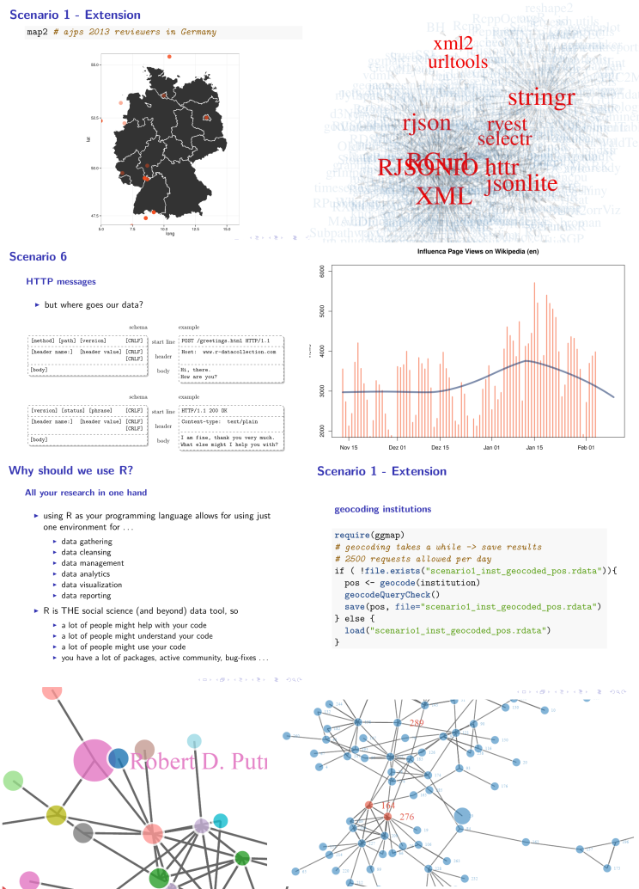

# *Welcome to my page.*

## News

### *Web Scraping With R -- Read The Book*

Interested in web scraping and web data collection? Since the very end of 2014 there is a book for that. 

... visit the books  [web page](http://www.r-datacollection.com/)  
... stalk the authors:  [Simon Munzert](http://simonmunzert.github.io/) / [Christian Rubba](http://christianrubba.com/) / [Peter Meißner](http://pmeissner.com) / [Dominic Nyhuis](https://www.youtube.com/watch?v=SiYrSYd7mlc><https://www.youtube.com/watch?v=SiYrSYd7mlc)  
... buy the   [book](http://eu.wiley.com/WileyCDA/WileyTitle/productCd-111883481X.html) 

### *Web Scraping With R -- Take The Course*

Interested in web scraping and web data collection? I will teach a course about web scraping with R at the ECPR Winter School of Methods and Techniques - 29 February - 3 March 2016 . [Have a look here ...](http://ecpr.eu/Events/PanelDetails.aspx?PanelID=4528&EventID=103)

