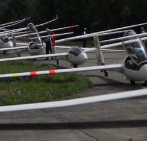

# <a href='http://thomasdiemar.de/'>Thomas Diemar </a>
fotografie

# <a href='http://www.lorenz-ebersbach.de/'>Lorenz Ebersbach </a>
time based art

# <a href='http://simonmunzert.github.io/'>Simon Munzert </a>
political science. surveys. data. web scraping. and all that.

# <a href='http://sebastianschutte.net/'>Sebastian Schutte </a>
Research on conflict, pictures of airplanes

