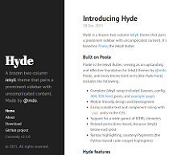
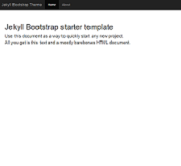
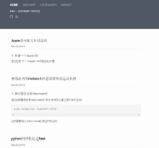
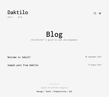
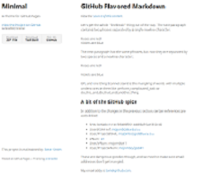

## rOpenGov

R projects concerned with political / government data.

http://ropengov.github.io/projects/


## (notable) CRAN task views

- [Social sciences](https://cran.r-project.org/web/views/SocialSciences.html)
		- find all those different regression models
- [Web technologies](https://cran.r-project.org/web/views/WebTechnologies.html)
		- anything for making and breaking the Web
		- scraping and parsing of Web formats
		- API access
- [Official Statistics](https://cran.r-project.org/web/views/OfficialStatistics.html)
		- more sexy than you think
		- record linkage
		- seasonal adjustment 
		- weighting
		- small area estimation
		- imputation
- [Machine Learning](https://cran.r-project.org/web/views/MachineLearning.html)


## Awesome list of awesome R stuff

https://github.com/qinwf/awesome-R


## Nginx logging

https://www.digitalocean.com/community/tutorials/how-to-configure-logging-and-log-rotation-in-nginx-on-an-ubuntu-vps


## IP address ranges / CIDR

https://www.digitalocean.com/community/tutorials/understanding-ip-addresses-subnets-and-cidr-notation-for-networking
https://de.wikipedia.org/wiki/Classless_Inter-Domain_Routing


## Likable Jekyll - Themes - That I like

### Mark Otto ([mdo](https://github.com/mdo)) :

<a href="http://hyde.getpoole.com/">

</a>


### Gerald Bauer ([geraldb](https://github.com/geraldb)) :

<a href="http://drjekyllthemes.github.io/jekyll-bootstrap-theme/">
  
</a>


### Pinocchio ([smallmuou](https://github.com/smallmuou)) :

<a href="http://wenva.github.io/index.html">
  
</a>


### Motaquillah Maddane ([kronik3r](https://github.com/kronik3r)): 

<a href="http://hitchhiker.ma/daktilo//">
  
</a>


### Steve Smith ([orderedlist](https://github.com/orderedlist)): 

<a href="http://orderedlist.com/minimal/">
 
</a>


## Wilson et al. (2014): *Best Practices for Scientific Computing*. PLoS Biol 12(1): e1001745. 

> Scientists spend an increasing amount of time building and
using software. However, most scientists are never taught how to
do this efficiently. As a result, many are unaware of tools and
practices that would allow them to write more reliable and
maintainable code with less effort. We describe a set of best
practices for scientific software development that have solid
foundations in research and experience, and that improve
scientists’ productivity and the reliability of their software. [...] 
[PDF](http://www.plosbiology.org/article/fetchObject.action?uri=info:doi/10.1371/journal.pbio.1001745&representation=PDF)
[DOI](doi:10.1371/journal.pbio.1001745) 


## Danilo Freire (2015-12-08) *Peering at Open Peer Review*. The Political Methodologist

> Peer review is an essential part of the modern scientific process. Sending manuscripts for others to scrutinize is such a widespread practice in academia that its importance cannot be overstated. Since the late eighteenth century, when the Philosophical Transactions of the Royal Society pioneered editorial review,1 virtually every scholarly outlet has adopted some sort of pre-publication assessment of received works. Although the specifics may vary, the procedure has remained largely the same since its inception: submit, receive anonymous criticism, revise, restart the process if required. A recent survey of APSA members indicates that political scientists overwhelmingly believe in the value of peer review (95%) and the vast majority of them (80%) think peer review is a useful tool to keep themselves up to date with cutting-edge research (Djupe 2015, 349). But do these figures suggest that journal editors can rest upon their laurels and leave the system as it is? [...] [LINK](http://thepoliticalmethodologist.com/2015/12/08/peering-at-open-peer-review/)


## Checking for non-ASCII characters in R

```r 
tools::showNonASCII(readLines("filename.txt"))
```


## No Energy Saving for WLAN on Pi

https://www.datenreise.de/raspberry-pi-wlan-einrichten-edimax/


## R's source code on Github (search-able)

https://github.com/wch/r-source

## Searching through the source code of ALL packages on CRAN

https://github.com/search?utf8=%E2%9C%93&q=user%3Acran&type=Code&ref=searchresults

## Getting R's Source Code

https://cran.r-project.org/sources.html


## rmarkdown: Alter Action Depending on Document

https://trinkerrstuff.wordpress.com/2014/11/18/rmarkdown-alter-action-depending-on-document/

## Listen Wikipedia by Hatnote 

Changes to Wikipedia as sound - tune in and chill out ... 

[http://listen.hatnote.com](http://listen.hatnote.com/#en)


## Administrative Boundaries Datasets (shape, R, EXRI, kmz, ... )

[Global Administrative Areas - Boundaries without limits](http://gadm.org/about)


## Linux pandoc for images / convert jpg to pdf

http://www.imagemagick.org/script/convert.php

*install:*

```bash
sudo apt-get imagemagick
```

*jpg to small grey scale pdf*

```bash
convert -density 300x300 -quality 2 -compress jpeg -colorspace Gray -colors 64 input1.jpg input2.jpg output.pdf
```

## saving RasPi image 

https://linuxundich.de/raspberry-pi/linux-images-fuer-den-raspberry-pi-auf-sd-karte-installieren/

## AutoHotKey for Linux

- autokey source: https://github.com/guoci/autokey-py3
- scripting API: http://autokey.googlecode.com/svn/trunk/doc/scripting/index.html
- example scripts: https://code.google.com/p/autokey/wiki/ContributedScripts

*install:* 

```bash
sudo apt-get autokey-qt
```

*"push marked text from Gedit to terminal"-autokey-script:*

```python
# autokey/python script for pushing text from Gedit to terminal
window.activate(title=":ACTIVE:")

# get class and title of current window, save clipboard
var1    = window.get_active_class()
title1  = window.get_active_title()
oldtext = clipboard.get_clipboard()
text =""

# only execute script from Gedit
if var1 == "gedit.Gedit" : 
    var2    = window.get_active_title()
    text    = clipboard.get_selection()
    window.activate(title="Terminal") 
    
    # paste to terminal
    if var2 == "Terminal" : 
        keyboard.send_keys(text)
        keyboard.send_keys("\n")

    # go back to Gedit
    window.activate(title=title1)

# restore clipboard
clipboard.fill_clipboard(oldtext)
```


## Adding CRAN mirror to repository list on Linux Ubuntu / Mint

https://cran.r-project.org/bin/linux/ubuntu/README.html


## A collection of text files on politics

http://www.textfiles.com/politics/


## A CC licensed book on string manipulations in R - Gaston Sanchez

http://gastonsanchez.com/Handling_and_Processing_Strings_in_R.pdf


## No Github passwords any more!

http://www.tilcode.com/push-github-without-entering-username-password-windows-git-bash/


## #!/usr/bin/Rscript not working 

http://stackoverflow.com/questions/2920416/configure-bin-shm-bad-interpreter


## adding mime type to Linux / *buntu and changing icon

http://askubuntu.com/a/56725/183446


## pushing to Github without username / password input 

http://stackoverflow.com/questions/8588768/git-push-username-password-how-to-avoid


## dinosaur data and pictures

http://www.nhm.ac.uk/discover/dino-directory/name/a/gallery.html


